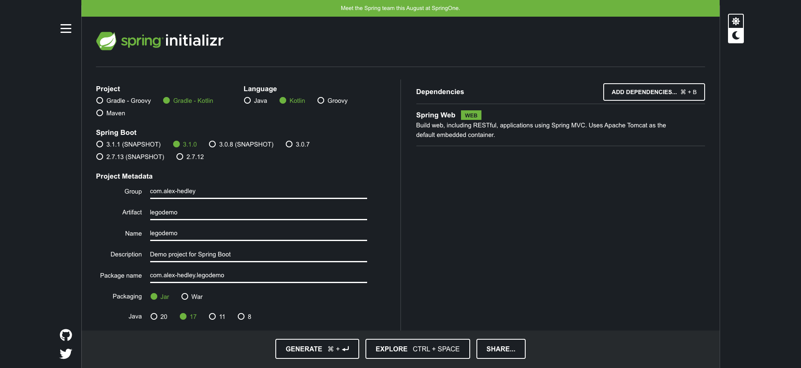

# Docs

- [Using Swagger (OpenAPI) for a Spring REST API With Kotlin](https://www.baeldung.com/kotlin/swagger-spring-rest-api)
- [Source](https://github.com/Baeldung/kotlin-tutorials/tree/master/kotlin-gradle-openapi)

Create an initial project

- https://start.spring.io



Add `implementation("org.springdoc:springdoc-openapi-starter-webmvc-ui:2.1.0")`

instead of

```kotlin
implementation("org.springdoc:springdoc-openapi-data-rest:1.6.0")
implementation("org.springdoc:springdoc-openapi-ui:1.6.0")
implementation("org.springdoc:springdoc-openapi-kotlin:1.6.0")

```

As it's using v3 of Spring Boot

```kotlin
plugins {
    id("org.springframework.boot") version "3.1.0"
}
```

not v2: `id("org.springframework.boot") version "2.6.2"`

Add a Controller

- [BrickController.kt](../src/src/main/kotlin/com/alexhedley/legodemo/api/BrickController.kt)

Annotate with the required info.

Run the app and go to

- http://localhost:8080/swagger-ui.html

## OpenAPI Generator

- https://openapi-generator.tech
- https://github.com/OpenAPITools/openapi-generator
- https://plugins.gradle.org/plugin/org.openapi.generator 6.6.0

## Spring Doc

- https://springdoc.org
